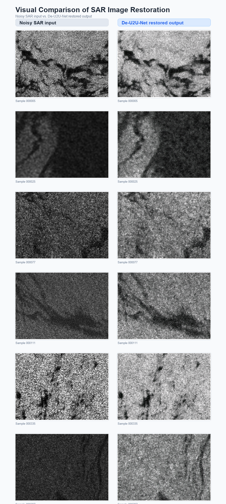

<div align="center">

# De-U2U-Net

**Task-Aware Self-Supervised SAR Image Restoration for Marine Oil Spill Mapping**

<p>
  
  
  
  
</p>

<p>
  <a href="https://henryxie2023.github.io/deu2unet_project_page/demo/index.html"><b>Online Static Demo</b></a>
</p>



</div>

## Overview

De-U2U-Net is a task-aware self-supervised SAR image restoration framework designed for marine oil spill mapping. The project focuses on reducing speckle-like degradation while preserving oil-spill boundaries and downstream mapping cues.

This repository currently serves as the official project page. The complete reproducible codebase will be released after manuscript acceptance.

## Method Highlights

- Self-supervised restoration setting for SAR imagery where clean references are limited.
- Dual-branch restoration design for spatial and transform-domain cues.
- Task-aware fusion intended to retain oil-spill morphology and boundary structure.
- Static visual demo for quick qualitative inspection.

## Visual Demo

The static demo provides paired SAR examples with noisy inputs and restored outputs:

[Open the static demo](https://henryxie2023.github.io/deu2unet_project_page/demo/index.html)

The summary comparison figure above uses six representative samples from the review/demo set.

## Experimental Summary

Qualitative examples show reduced granular degradation and clearer structural continuity in suspected oil-spill regions. Quantitative results and full experimental protocols will be reported in the manuscript and released with the reproducibility package after acceptance.

## Code Release Status

The current repository is limited to the project page and static visual demonstration. It does not include model source code, training scripts, inference scripts, checkpoints, or weights.

The complete reproducible codebase will be released after manuscript acceptance.

## Review-Only Reproducibility Package

During review, reproducibility materials can be provided through the designated review channel when required by the venue. Public code, checkpoints, and detailed reproduction scripts will be made available after acceptance.

## Previously Released Projects

Related public resources and prior released projects will be linked here after the anonymous review constraints are finalized.

## Dataset Information

The visual examples in this project page are prepared for demonstration of SAR restoration behavior. Dataset sources, access conditions, preprocessing details, and usage restrictions will be documented in the final release.

## Citation

```bibtex
@misc{deu2unet2026,
  title  = {De-U2U-Net: Task-Aware Self-Supervised SAR Image Restoration for Marine Oil Spill Mapping},
  author = {Yiheng Xie, Xiaoping Rui*, Yarong Zou*, Heng Tang, Ninglei Ouyang, Hongyue Zhang, Zihao Yin},
  year   = {2026},
}
```

## License / Release Notice

This repository is currently an official project page for a manuscript under review. License terms for the complete code release will be provided together with the accepted-version release.
